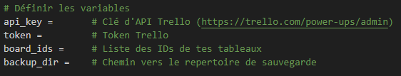
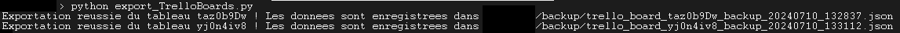
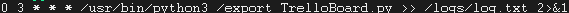
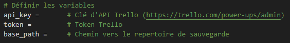
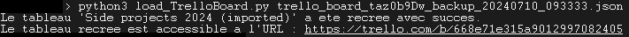
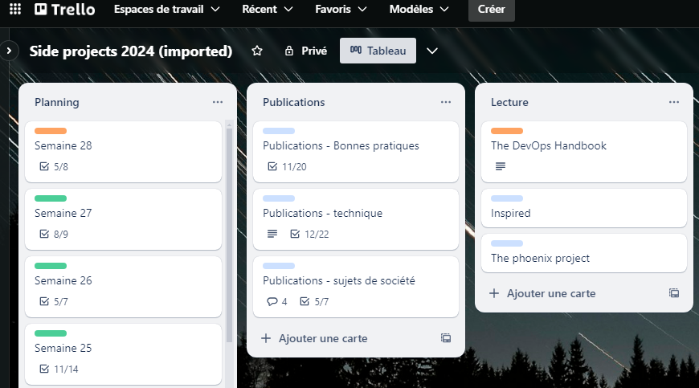

# Automatisation de la sauvegarde de tableaux Trello

Créer une clé API pour Trello
**Ressources**
https://developer.atlassian.com/cloud/trello/guides/rest-api/api-introduction/
https://trello.com/power-ups/admin

## Créer un script Python pour automatiser la savegarde des tableaux Trello
Sauvegarde des informations relatives aux tableaux, fond d'écran, listes, cartes, labels, commentaires et checklist
export_TrelloBoards.py 

Liste des tableaux à sauvegarder
board_ids = ['taz0b9Dw', '...', '...']  # Liste des IDs de tes tableaux
où la clé du tableau est accessible via l'URL du tableau https://trello.com/b/taz0b9Dw/side-projects-2024
 
**Donner les droits d'exécution** 
chmod +x export_TrelloBoards.py

**Exécution du script** 
python3 export_TrelloBoards.py

## Sécuriser de la clé et le token
export TRELLO_API_KEY='...'
export TRELLO_API_TOKEN='...'
source ~/.bashrc

## Créer un cron pour automatiser la sauvegarde
crontab -e
crontab -l

## Création d'un shell Linux pour supprimer les sauvegardes anciennes
cleanup_logs.sh

**Donner les droits d'exécution** 
chmod +x cleanup_logs.sh

**Lancement** 
./cleanup_logs.sh

## Créer d'un script Python pour créer un tableau Trello à partir d'une sauvegarde JSON
Chargement des informations du tableau d'origine, fond d'écran, listes, cartes, labels, commentaires et checklist
load_TrelloBoard.py 

**Donner les droits d'exécution** 
chmod +x load_TrelloBoard.py

**Exécution du script** 
python load_TrelloBoard.py trelloBoardName

